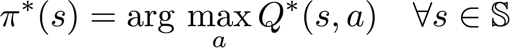

# Project Report

## Learning algorithm

Agents use a policy to decide which actions to take within an environment. The primary objective of the learning algorithm is to find an optimal policy—i.e., a policy that maximizes the reward for the agent. Since the effects of possible actions aren't known in advance, the optimal policy must be discovered by interacting with the environment and recording observations. Therefore, the agent "learns" the policy through a process of trial-and-error that iteratively maps various environment states to the actions that yield the highest reward. This type of algorithm is called Q-Learning.

- #### Q-Function
To discover an optimal policy, I setup a Q-function. The Q-function calculates the expected reward `R` for all possible actions `A` in all possible states `S`.

We can then define our optimal policy `π*` as the action that maximizes the Q-function for a given state across all possible states. The optimal Q-function `Q*(s,a)` maximizes the total expected reward for an agent starting in state `s` and choosing action `a`, then following the optimal policy for each subsequent state.

In order to discount returns at future time steps, the Q-function can be expanded to include the hyperparameter gamma `γ`.

- #### Deep Q-Network (DQN)
With Deep Q-Learning, a deep neural network is used to approximate the Q-function. Given a network `F`, finding an optimal policy is a matter of finding the best weights `w` such that `F(s,a,w) ≈ Q(s,a)`.

## Model Architecture and Parameters
 - Fully connected layer - input: 37 (state size) output:64  
 - Fully connected layer - input: 64 output 64  
 - Fully connected layer - input: 64 output: 4 (action size)
  

**Parameters used in DQN algorithm:**

  - Maximum steps per episode: 1000  
  - Starting epsilion: 1.0  
  - Ending epsilion: 0.01  
  - Epsilion decay rate: 0.995
  

  ## Training and Test Result
The agent is able to solve the task (13+ score in consective 100 episodes) in less than 600 espisodes. Starting from 750 espisode, agent can get steady score at around 15+.

- **Train Chart**

## 

- **Test Chart**

**Test Average Score: 16.76**

## Future Improvements
- **Try More Parameter Combinations** &mdash; It's always interesting to test different parameters sets such as epsilon, decay rate, size of the hidden layer of neural networks to see how things will change.

- **Try Double Q Learning** &mdash;One issue with Deep Q-Networks is they can overestimate Q-values.The accuracy of the Q-values depends on which actions have been tried and which states have been explored. If the agent hasn't gathered enough experiences, the Q-function will end up selecting the maximum value from a noisy set of reward estimates. Early in the learning process, this can cause the algorithm to propagate incidentally high rewards that were obtained by chance (exploding Q-values). This could also result in fluctuating Q-values later in the process. So it's worth trying double Q Learning algorithm. 

  
